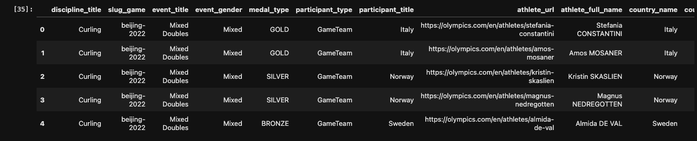
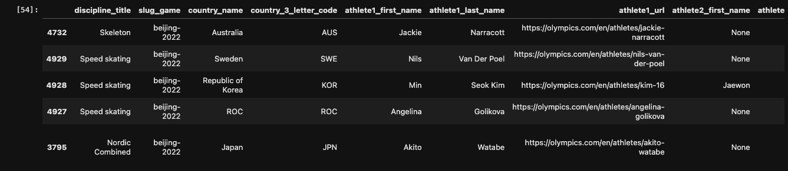
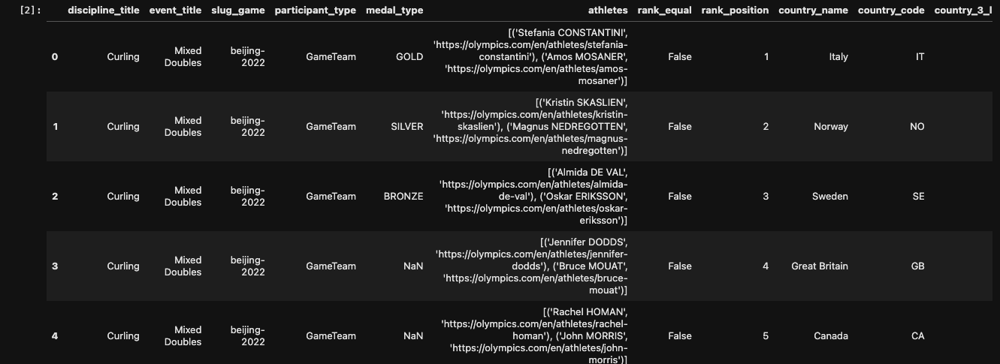
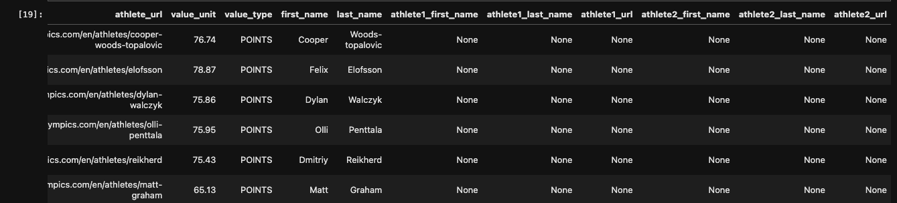
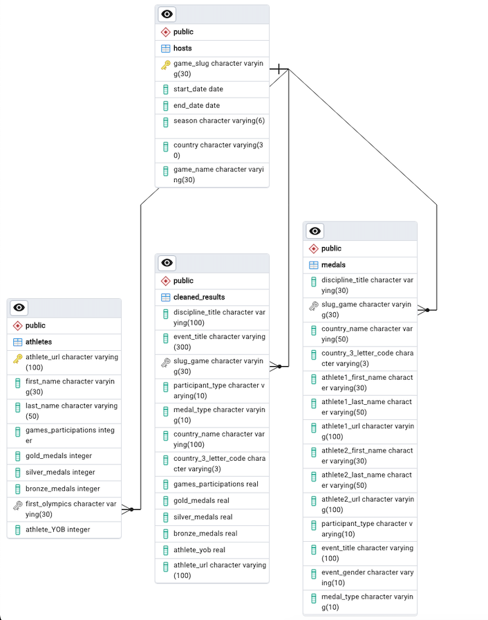
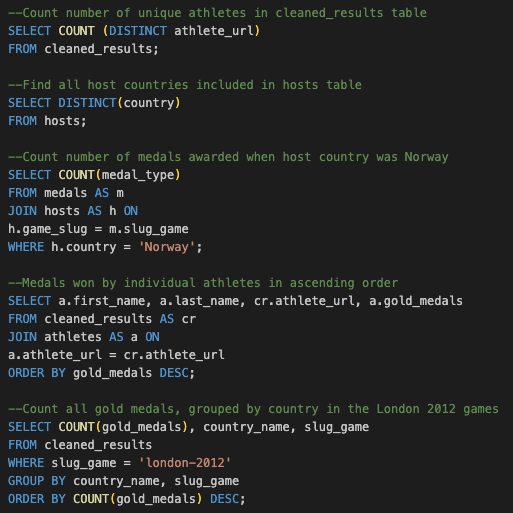

# Olympic Summer & Winter Games, 1896-2022: Data Engineering

## Background 
This project was completed by Karan Dogra, Paolo Arciaga, Amy Larsen, and Richard Bialick. We used a historical dataset on the Olympic Games, including all the games from Athens 1896 to Beijing 2022 via [Kaggle](https://www.kaggle.com/datasets/piterfm/olympic-games-medals-19862018) 

This dataset's original files are comprised of all historical data on: 
- Olympic Hosts
- Olympic Athletes
- Olympic Medals
- Olympic Results 

# ETL Workflow:

## Data Cleaning 
Extracted and transformed our original CSVs to create new DataFrames that were ultimately used as tables to create an ERD and a new SQL database.    

- ### Olympic Hosts
    - Original: 
    - Cleaned: 
        - Stored CSV into a Pandas DataFrame
        - Converted the datetime columns to datetime format and removed the time 
        - Split the city and year columns 
        - Renamed columns  
        - Exported the cleaned DataFrame as a CSV and saved to our repo 
- ### Olympic Athletes
    - Original: 
    - Cleaned: 
        - Stored CSV into a Pandas DataFrame
        - Split the athlete full name column into two separate first and last name columns 
        - Converted last names to lower case 
        - Capitalized the first letter of each last name 
        - Used RegEx to capitalize the first letter of last names with hyphens, as well as last names with 2 names 
        - Converted the YOB column to an integer 
        - Used RegEx to fix the medals column and created 3 new columns to represent gold, silver, and bronze medals won. 
        - Converted each medal column to an integer 
        - Dropped unwanted columns
        - Reordered and renamed columns 
        - Used RegEx to format the first_olympics column as city-year 
        - Exported the cleaned DataFrame as a CSV and saved to our repo
- ### Olympic Medals 
    - Original: 
    - Cleaned: 
        - Stored CSV into a Pandas DataFrame
        - Capitalized the first letter of each last name 
        - Grouped the data by 'discipline_title', 'slug_game', and 'country_name' columns
        - Sorted a custom order to the 'slug_game' column
        - Exported the cleaned DataFrame as a CSV and saved to our repo
- ### Olympic Results
    - Original: 
    - Cleaned: 
        - Stored CSV into a Pandas DataFrame
        - Replaced missing values in the 'athlete_full_name' columns with a space
        - Capitalized the first letter of each last name 
        - Separated 'athlete_url' column into multiple columns, due to games classified as 'GameTeam' populated multiple athletes into one 
        - Exported the cleaned DataFrame as a CSV and saved to our repo
- ### Combined Dataset 
We combined the cleaned versions of the athlete and results table into 1 and named it Cleaned_Combined. 

## Entity Relationship Diagram

Upon finalizing our ERD, we successfully loaded our Athletes and Hosts tables first, and then successfully loaded our medals and combined results tables afterwards. 

## How to Use & Interact With Our Database
- Step 1: Start by downloading and/or using a SQL tool such as PostgreSQL/pgAdmin 
- Step 2: Import our table schema titled 'FINAL_Table_Schema.sql' in our Olympic_Files folder 
- Step 3: Upload the 4 tables from our ERD in their respective tables, according to their cleaned CSV versions, in the following order: 
    - 3a: Athletes (cleaned_olympic_athletes.csv)
    - 3b: Hosts (cleaned_olympic_hosts.csv)
    - 3c: Medals (medals_cleaned.csv)
    - 3d: Combined Results (clean_combined.csv)
- Explore our Olympics Database by writing your own SQL queries! 
    - Example queries can be found in our file titled 'olympic_database_query.sql'

## Benefits of Using SQL 
Using SQL (Structured Query Language) offers several benefits for our Olympics Data Engineering ETL project:
- Ease of Data Retrieval: SQL provides a simple and intuitive way to query and retrieve data from relational databases like Postgres, allowing us to efficiently access the information we need for our analysis tasks.

- Data Aggregation and Transformation: SQL's powerful aggregation functions and data manipulation capabilities enable us to aggregate, filter, and transform the dataset as needed, facilitating the preparation of data for further analysis and reporting.

- Scalability: SQL databases are highly scalable, capable of handling large volumes of data efficiently. This scalability ensures that our project can accommodate the growing dataset size associated with Olympic Games data over time.

- Data Modeling and Schema Design: SQL allows us to define and implement data models and database schemas that accurately represent the Olympic Games data structure, facilitating efficient data storage, retrieval, and analysis.

## Ethical Considerations
In our Olympics Data Engineering ETL project, we have made several efforts to address ethical considerations throughout the data processing pipeline. We have been transparent about our data collection methods, sources, and processing steps, providing clear documentation to foster trust and accountability. Moreover, we have prioritized data security measures to safeguard against unauthorized access, data breaches, and misuse of the dataset. By incorporating these ethical considerations into our project, we aim to uphold the integrity of the data and mitigate potential risks associated with its use while promoting responsible and ethical data practices.

