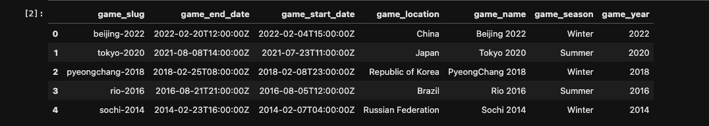

# Olympic Summer & Winter Games, 1896-2022: Data Engineering

## Background 
This project was completed by Karan Dogra, Paolo Arciaga, Amy Larsen, and Richard Bialick. We used a historical dataset on the Olympic Games, including all the games from Athens 1896 to Beijing 2022 via [Kaggle](https://www.kaggle.com/datasets/piterfm/olympic-games-medals-19862018) 

This dataset's original files are comprised of all historical data on: 
- Olympic Hosts
- Olympic Athletes
- Olympic Medals
- Olympic Results 

## Data Cleaning 
- Olympic Hosts
    - Original: 
    - Cleaned: 
- Olympic Athletes
    - Original: 
    - Cleaned: 
