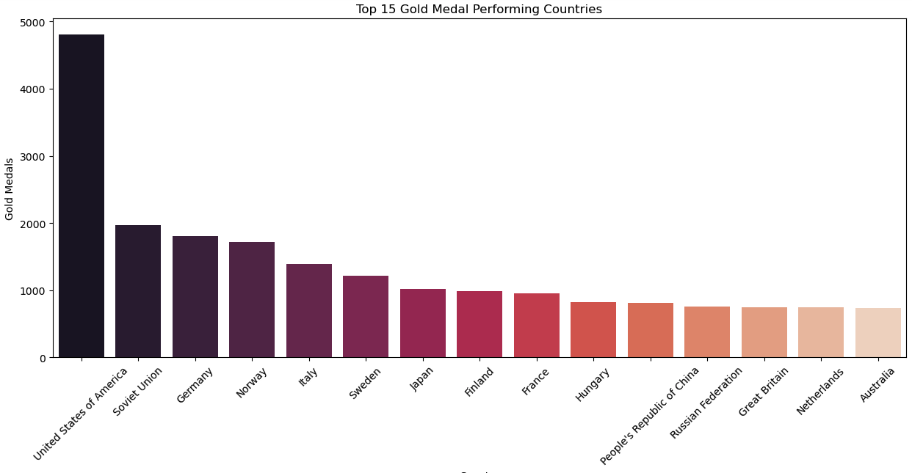

# Olympic Summer & Winter Games, 1896-2022: Data Engineering

## Background 
This project was completed by Karan Dogra, Paolo Arciaga, Amy Larsen, and Richard Bialick. We used a historical dataset on the Olympic Games, including all the games from Athens 1896 to Beijing 2022.  
    - More than 21,000 medals, 162,000 results, 74,000 athletes, 20,000 biographies, and 53 hosts of the Summer and Winter Olympic Games can be found in this dataset.

This dataset's original files are comprised of all historical data on:  
- Olympic Athletes: personal information about athletes (name, short bio, etc.)
- Olympic Medals: general information on medalists (Athlete or Team)
- Olympic Hosts: hosts (year, city, country, etc)
- Olympic Results: general information on results (Athlete or Team)

Data Source: [Kaggle](https://www.kaggle.com/datasets/piterfm/olympic-games-medals-19862018)

# ETL Workflow:
With the Summer 2024 Olympic Games coming up, our goal was to create a database that can be used by anyone who wants to look up historical data on any past game up until our most recent Olympics, which was in 2022. 

## Data Cleaning 
Extracted and transformed our original CSVs to create new DataFrames that were ultimately used as tables to create an ERD and a new SQL database.    

- ### Olympic Hosts
    - Original: 
    - Cleaned: 
        - Stored CSV into a Pandas DataFrame
        - Converted the datetime columns to datetime format and removed the time 
        - Split the city and year columns 
        - Renamed columns  
        - Exported the cleaned DataFrame as a CSV and saved to our repo 
- ### Olympic Athletes
    - Original: 
    - Cleaned: 
        - Stored CSV into a Pandas DataFrame
        - Split the athlete full name column into two separate first and last name columns 
        - Converted last names to lower case 
        - Capitalized the first letter of each last name 
        - Used RegEx to capitalize the first letter of last names with hyphens, as well as last names with 2 names 
        - Converted the YOB column to an integer 
        - Used RegEx to fix the medals column and created 3 new columns to represent gold, silver, and bronze medals won. 
        - Converted each medal column to an integer 
        - Dropped unwanted columns
        - Reordered and renamed columns 
        - Used RegEx to format the first_olympics column as city-year 
        - Exported the cleaned DataFrame as a CSV and saved to our repo
- ### Olympic Medals 
    - Original: 
    - Cleaned: 
        - Stored CSV into a Pandas DataFrame
        - Capitalized the first letter of each last name 
        - Grouped the data by 'discipline_title', 'slug_game', and 'country_name' columns
        - Sorted a custom order to the 'slug_game' column
        - Exported the cleaned DataFrame as a CSV and saved to our repo
- ### Olympic Results
    - Original: 
    - Cleaned: 
        - Stored CSV into a Pandas DataFrame
        - Replaced missing values in the 'athlete_full_name' columns with a space
        - Capitalized the first letter of each last name 
        - Separated 'athlete_url' column into multiple columns, due to games classified as 'GameTeam' populated multiple athletes into one 
        - Exported the cleaned DataFrame as a CSV and saved to our repo
- ### Combined Dataset 
We combined the cleaned versions of the athlete and results table into 1 and named it Cleaned_Combined. 

## Additional Library
- We imported Seaborn to visualize the top 15 gold medal performing countries over the years, which can be found in our cleaned_combined notebook. 

## Entity Relationship Diagram

Upon finalizing our ERD, we successfully loaded our Athletes and Hosts tables first, and then successfully loaded our medals and combined results tables afterwards. 

## Limitations / Complications
- Our data is limited to athletes that only participate as individuals or doubles. 
    - Athletes that participated in events that are comprised of teams of more than 2 are not included in our dataset. 
- Athlete_url caused complications because there were ~76,000 athletes urls in the Athletes table and ~162,000 total athletes (first and last names) in the Results table.
    - All athletes in the Athletes table were in the Results table
    - Not all athletes had urls in the Results table
    - Not all athletes had unique names, but did have a unique url
- For example, in the Athletes table, the “athlete_url” column contained multiple names/urls for team sports with multiple athletes. We chose to separate the individual athletes into separate columns (athlete_url, athlete1_url, athlete2_url). However, in this cleaning process, we did not create a single column with unique athletes. This meant that the athletes would not be a good primary key to connect the tables with.
    - The solution was to create a unique identifier for the athletes in the Results table that did not have a urls, so we created the Cleaned_Results table which was a combination of the original Results and Athletes table
- Data types are important in uploading the data
    - When setting up the database in pgAdmin, a challenge was assigning the correct datatypes to the columns. Since our datasets were large (160,000 athletes, 50 sports, 200 participating countries, 26 host countries, etc) we couldn’t just eyeball the dataset to estimate how long the various strings were. My solution was to overestimate the characters to avoid getting the same error message again.
    - Some numbers were integers initially but changed to numbers with decimals during the cleaning process. This affected the datatype that was uploaded into the database. Instead of an “Integer”, the number was now a “float”.

## How to Use & Interact With Our Database
- Step 1: Start by downloading and/or using a SQL tool such as PostgreSQL/pgAdmin 
- Step 2: Import our table schema titled 'FINAL_Table_Schema.sql' in our Olympic_Files folder 
- Step 3: Upload the 4 tables from our ERD in their respective tables, according to their cleaned CSV versions, in the following order: 
    - 3a: Athletes (cleaned_olympic_athletes.csv)
    - 3b: Hosts (cleaned_olympic_hosts.csv)
    - 3c: Medals (medals_cleaned.csv)
    - 3d: Combined Results (clean_combined.csv)
- Explore our Olympics Database by writing your own SQL queries! 
    - Example queries can be found in our file titled 'olympic_database_query.sql'

## Benefits of Using SQL 
Using SQL (Structured Query Language) offers several benefits for our Olympics Data Engineering ETL project:
- Ease of Data Retrieval: SQL provides a simple and intuitive way to query and retrieve data from relational databases like Postgres, allowing us to efficiently access the information we need for our analysis tasks.

- Data Aggregation and Transformation: SQL's powerful aggregation functions and data manipulation capabilities enable us to aggregate, filter, and transform the dataset as needed, facilitating the preparation of data for further analysis and reporting.

- Scalability: SQL databases are highly scalable, capable of handling large volumes of data efficiently. This scalability ensures that our project can accommodate the growing dataset size associated with Olympic Games data over time.

- Data Modeling and Schema Design: SQL allows us to define and implement data models and database schemas that accurately represent the Olympic Games data structure, facilitating efficient data storage, retrieval, and analysis.

## Ethical Considerations
In our Olympics Data Engineering ETL project, we have made several efforts to address ethical considerations throughout the data processing pipeline. We have been transparent about our data collection methods, sources, and processing steps, providing clear documentation to foster trust and accountability. Moreover, we have prioritized data security measures to safeguard against unauthorized access, data breaches, and misuse of the dataset. By incorporating these ethical considerations into our project, we aim to uphold the integrity of the data and mitigate potential risks associated with its use while promoting responsible and ethical data practices.

